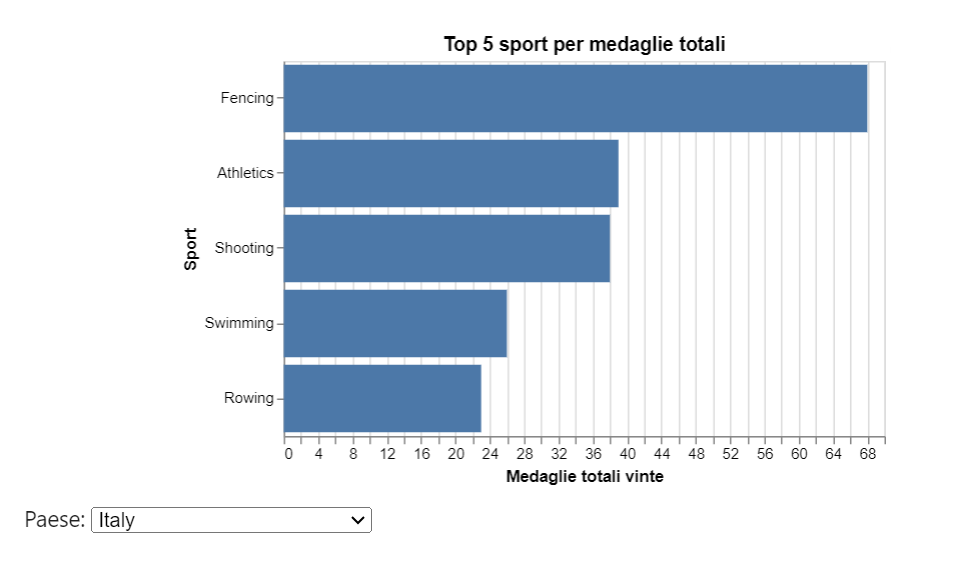

    

# I fattori socioeconomici del successo olimpico

## Text Analysis: perché l’Italia è una potenza nella scherma?

Dall’analisi dei dati olimpici è emerso chiaramente che esiste un gruppo di paesi specializzati in poche discipline, in cui si concentra la maggior parte delle medaglie. Chiedersi quali siano i fattori che determinano il successo sportivo di questi paesi, dunque, è un quesito che va ulteriormente precisato chiedendosi perché il successo sia maggiore in certe discipline invece che in altre.

L’Italia è proprio uno dei paesi più specializzati ed è a tutti noto come, storicamente, moltissime medaglie siano arrivate dalla scherma. Non potendo indagare i casi di tutti le “potenze sportive specialistiche”, ci siamo così concentrati sul caso italiano: perché l’Italia è particolarmente forte nella scherma?

Per trovare una risposta abbiamo adoperato gli strumenti della Text e Sentiment Analysis. Abbiamo scaricato circa 400 articoli del quotidiano La Repubblica, dedicati alla scherma italiana e pubblicati negli anni fra il 2000 e il 2024. Li abbiamo poi passati a un Language Model a cui è stato richiesto di trovare, all’interno di tale spaccato dell’opinione pubblica, i possibili motivi del successo dell’Italia nella scherma.

Il modello ha fornito una risposta piuttosto precisa e verosimile, confermata e arricchita anche dall’esperto che in seguito abbiamo intervistato (vedi l'intervista dedicata):
- esistenza di una lunga tradizione di schermidori
- supporto da parte di FIS (Federazione Italiana Scherma) e governo nell’implementazione di efficaci politiche sportive, in particolare per quanto riguarda la formazione degli atleti e la qualità dell’allenamento
- presenza di molti atleti di alto livello che hanno creato squadre forti nel temporale
- forte esposizione mediatica della scherma.

Infine, abbiamo fatto anche un’analisi emotiva degli articoli di giornali. Usando un modello in grado di riconoscere 27 emozioni differenti in un testo, abbiamo ottenuto dei punteggi per articolo e per emozioni (punteggio compreso fra 0 e 1, nel grafico portato a percentuale). Facendo una media, si può vedere come gli articoli siano “neutrali” al 51%; tuttavia, emozioni quali “approvazione” (11%), “ammirazione” ecc. ottengono comunque punteggi rilevanti. 

<iframe src="chart_emotions_barchart.html" width="800" height="600"></iframe>

La conclusione che si può tirare è che la scherma italiana, in virtù della sua consolidata tradizione di successi, è più di un semplice sport. La scherma è entrata a far parte dell’identità non solo sportiva dell’Italia, cosa testimoniata anche dall’interesse delle istituzioni pubbliche, ed è caricata di significati e aspettative che vanno al di là della performance sportiva. Ecco che, allora, parlare di scherma non è un semplice “resoconto” ma una narrazione emotivamente connotata, espressione di una parte importante dell’identità nazionale.  