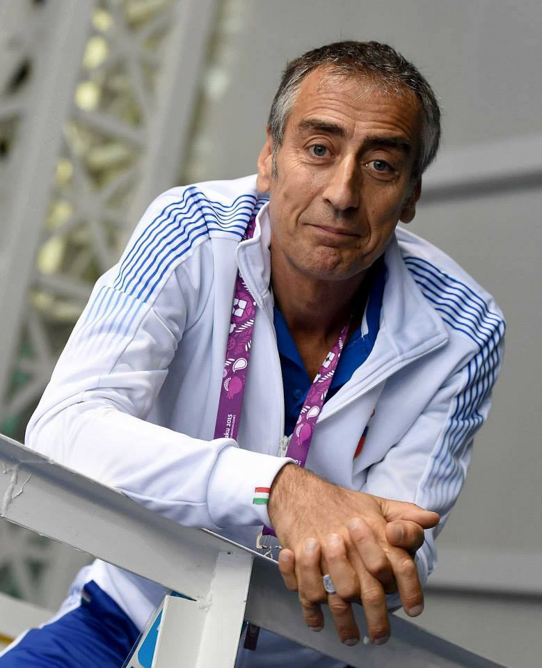

# Intervista a Enrico Di Ciolo

## Introduzione

Nel Progetto *Non solo giochi*, sviluppato a conclusione del Master dell’Università di Pisa *Big Data & Artificial Intelligence for Society 2026*, ci siamo chiesti quali fossero i fattori che influenzano il successo sportivo di un paese nei Giochi Olimpici estivi. Abbiamo ampiamente documentato i risultati nel sito del progetto, scoprendo che il PIL gioca un ruolo fondamentale. 

Abbiamo anche scoperto che alcuni paesi sono delle potenze sportive “generaliste”, nel senso che ottengono molte medaglie in molte e diverse discipline; altri paesi, invece, sembrano specializzarsi, ottenendo quindi grandi risultati in un numero ristretto di specialità. È il caso dell’Italia che, come noto, da decenni miete successi olimpici nella scherma.

I dati non possono mentire, ma la loro interpretazione può non essere univoca. Abbiamo dunque pensato di rivolgerci ad un esperto di sport per scoprire se, in effetti, la sua visione potesse confermare le nostre intuizioni. Visto che il master ha il suo centro a Pisa, dunque, non potevamo lasciarci sfuggire l’occasione di entrare in contatto con una figura che ben conosce lo sport ai massimi livelli: Enrico Di Ciolo del Cspdiciolo o, per esteso, Club Scherma Pisa Antonio Di Ciolo.

Il testo che segue, a cura di Alessio Cioli, è il resoconto dell’intervista a Enrico Di Ciolo avvenuta nella sede del Club, giovedì 16 luglio 2026.

## Un po’ di storia

La storia del Cspdiciolo ha attraversato metà Novecento e, fra varie vicissitudini, arriva fino al 2026, anno in cui il Club ha coronato il sogno di edificare una palestra proprietaria in località I Passi, nella periferia pisana.

Tutto nasce però nel 1947, con Antonio Di Ciolo, il padre di Enrico, che all’indomani della Seconda Guerra mondiale va a Lucca a prendere lezioni dal Maestro Oreste Puliti per poi incontrare il Maestro Di Rosa, storico insegnante del Fides di Livorno – “ad oggi il club più medagliato al mondo”, mi dice Enrico. Antonio, nei decenni successivi, avrebbe poi fondato e portato avanti il Club Di Ciolo. 

Nel tempo qualche soddisfazione, al Cspdiciolo, se la sono tolta: “Abbiamo vinto 7 medaglie olimpiche, fra cui l’oro di Alessandro Puccini alle Olimpiadi del 1996. Nel complesso, fra Olimpiadi, Campionati del Mondo, Europei ecc., abbiamo conquistato più di 200 medaglie”. 

## Un metodo innovativo

Chiedo a Enrico che cosa abbia permesso al Cspdiciolo di ottenere risultati così importanti. Enrico si appassiona più a questo discorso che a elencare tutti i trofei vinti: è una questione di pedagogia “sintetica e naturale”. Enrico mi spiega che, nell’insegnamento tradizionale della scherma, tutto ruotava intorno al maestro, che mostrava all’allievo come eseguire i vari colpi; a quest’ultimo era chiesto, semplicemente, di riprodurre in maniera fedele quanto visto fare al maestro: “si trattava di una pedagogia imitativa”.

Ricorda Enrico che suo padre “si leggeva trenta o quaranta libri di psicologia e neuroscienze all’anno”; fu grazie a questa ricerca continua e alle intuizioni del Di Rosa che Antonio si rese conto che l’apprendimento dello sport non poteva prescindere dalla fisiologia e dalle tappe dello sviluppo psicofisico: “non puoi chiedere a un bambino di imparare come un adulto”.

Ma allora, quando i bambini vengono al Cspdiciolo per imparare, all’inizio per loro è un gioco? Enrico conferma e aggiunge che il pilastro del suo metodo è la lezione di gruppo. Il buon insegnante osserva quello che il bambino sa fare spontaneamente e da lì parte per far crescere le sue capacità. “La capacità è un recipiente invisibile, mentre l’abilità è la sua manifestazione; questa sì che si può osservare.  E non è che osservare sia un compito più facile; da insegnante, potrei spappardellare la mia conoscenza e finirla lì”. Invece, formare è un compito diverso e più difficile: non si può programmare l’allievo a ripetere i gesti di un maestro ma dovrà essere lui, grazie ai suoi consigli, a scoprire e diventare cosciente delle proprie capacità. 

Enrico rivendica che “la nostra è una vera e propria scuola; i bambini vengono qui per formarsi, non per affermarsi”. Poi, è chiaro, fra questi ce ne sarà qualcuno che rivelerà un talento particolare e, forse, sarà in grado di diventare un campione, ma non è questa la cosa più importante: “purtroppo, lo sport è considerato solo nella sua parte prestazionale ma dovrebbe essere più visibile quello che c’è prima”.

## I successi della scherma italiana

Anche gli altri club di scherma adottato un approccio pedagogico “naturale” come il Cspdiciolo? Qual è l’origine dei successi della scherma italiana? “Innanzitutto, la Federazione della scherma italiana è una delle più antiche del mondo; nasce già alla fine dell’Ottocento, ma la cultura della scherma era radicata nell’antichissima tradizione del duello”. La scherma, a quel tempo, era una disciplina utile: “serviva a rimanere vivi”, scherza Enrico. I maestri di inizio Novecento, sebbene non potessero conoscere la scienza dell’allenamento moderna, erano bravissimi “in modo istintivo” proprio perché venivano dalla cultura del duello.

“Poi, nel Novecento, la scherma diventa una disciplina sportiva” – penso subito che la risposta di Enrico conferma quello che avevamo trovato nella parte del Progetto dedicata alla Text Analysis. Enrico continua osservando come, un secolo e più fa, “esistevano due o tre diverse scuole di scherma in Italia che, entrando in concorrenza l’una con l’altra hanno generato successi e una tradizione di eccellenza”.  

“Oggi, invece, non esistono più delle scuole ma tanti approcci ‘contaminati’, cioè tante piccole tradizioni a livello di club”.  Avverto che Enrico parla con una punta d’amarezza; a me sembra una buona cosa che oggi esistano tante tradizioni diverse: “sì, però si tratta di solito di giovani maestri, alcuni formatisi anche da noi, che da poco hanno cominciato a insegnare in proprio. Ci vorranno venti o trent’anni per vedere se arriveranno risultati di un certo livello. Noi invece abbiamo una tradizione consolidata”.

## Il ruolo delle istituzioni

Il Cspdiciolo, ormai, è un club prestigioso e di fama mondiale – mentre svolgo l’intervista, in palestra si stanno allenando, fra gli altri, ragazzi provenienti dall’Egitto, dall’Australia, da Singapore, dalla Malesia e dal Guatemala; in teoria, una realtà così “virtuosa” potrebbe anche reggersi sulle proprie gambe, ma qual è il ruolo che le istituzioni hanno nel sostenere lo sport?

Enrico mi dice che il Club ha avuto un po’ di fortuna, perché alcuni ex allievi (Salvatore Sanzo e Frida Scarpa), dopo il loro percorso sportivo, hanno intrapreso una carriera all’interno delle istituzioni: il primo è stato assessore presso la Provincia di Pisa e dopo è diventato anche presidente del CONI Toscana mentre la seconda è attualmente assessore del Comune di Pisa. Grazie a figure di questo tipo, dunque, lo sport toscano, fra cui la scherma, ha potuto beneficiare di un’alta attenzione da parte delle istituzioni negli ultimi vent’anni, cosa che ha reso un po’ più facile la vita delle associazioni sportive.

In generale, bisogna dire che le istituzioni e la politica mettono a disposizione delle associazioni sportive diverse risorse. “Il problema”, dice Enrico, “è che solitamente la politica arriva dopo: contributi, bandi e premi arrivano dopo le medaglie. Ma l’aiuto servirebbe di più prima”. Per esempio, oggi si dà sempre più peso al tema dell’inclusione, ovvero alla questione dell’accesso allo sport per le persone disabili. “Si possono chiedere contributi per i prossimi ragazzi disabili che il club iscriverà: ma io già ce ne ho ora che fanno il programma di scherma”.

## L’origine della “forza” sportiva di un paese

Per concludere l’intervista, allarghiamo il discorso al sistema-paese nel suo complesso: cosa rende un paese “forte” da un punto di vista sportivo? Enrico non ha dubbi: servono “cultura sportiva, formazione continua e uno sviluppo sociale delle discipline”. Ma conta molto anche la buona organizzazione delle federazioni sportive: “Per esempio, il sollevamento pesi vent’anni fa praticamente non esisteva: oggi è uno dei fiori all’occhiello dell’Italia. I vertici sono non ex campioni, ma i migliori preparatori. Non è detto che il “migliore” (cioè il miglior atleta) sia anche un ottimo preparatore”.

Ma allora le risorse economiche, gli investimenti nelle infrastrutture non servono? Si può ottenere tanto con poco? “No, servono anche le risorse. Quello che di buono abbiamo è che, quando si arriva all’alto livello, lo stato, in Italia, dà la possibilità agli atleti di continuare ad allenarsi stando dentro le branche sportive delle forze dell’ordine. Questo gli consente di ritardare l’ingresso nel mondo del lavoro e continuare a dedicarsi allo sport a livelli eccellenti”. 

Questo è sicuramente un grosso e meritorio impegno che lo stato si prende ma, come Enrico già mi diceva, lo sport tende ad attirare la maggior parte delle attenzioni quando si “vedono” i grandi risultati, cioè quando gli atleti già formati cominciano ad ottenere successi rilevanti. Ma la parte più importante dello sport – e socialmente rilevante, per quelli che magari intendono solo coltivare una passione, aggiungerei io – è il lavoro che di formazione che viene prima dei risultati. 

Pisa, 16 luglio 2026