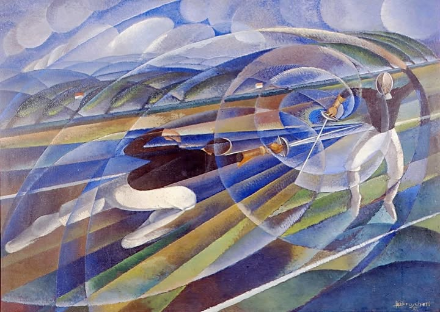



## La pipeline di Text Analysis

Per la prima parte della Text Analysis si è dovuto innanzitutto scaricare gli articoli della *Repubblica* attraverso un semplice algoritmo di scraping. I testi così scaricati sono stati poi puliti (rimozione dei caratteri mal codificati) e se ne è acquisita la data di redazione (in alcuni casi la data era contenuta nell’url stesso dell’articolo, altre volte, invece, era rintracciabile nel corpo del testo). Ciò fatto, gli articoli sono stati salvati in un file *repubblica_clean.json*: una lista di dizionari con chiavi *title*, *date*, *url* e *text*. Ogni dizionario viene così a rappresentare un articolo.

I testi sono stati poi passati al modello Llama 3.1 con 8 miliardi di parametri nella versione quantizzata a 4 bit. La relativamente piccola dimensione di questo modello ha fornito diversi vantaggi, in quanto ha consentito:
- di far girare il modello in locale su un pc equipaggiato con una GPU Nvidia RTX 5060 Ti con 16 GB di memoria VRAM;
- di impostare un contesto molto grande (64000 token) senza saturare la memoria della GPU;
- di avere libera memoria VRAM per caricare altri language model senza smontare Llama (vedi oltre).

Il prompt passato a Llama per scoprire le ragioni del successo dell’Italia nella scherma è stato così formulato:
<blockquote>
Rispondi alla domanda dell'utente con un testo continuo e articolato. Non rispondere in maniera schematica.  Cita nomi di personaggi importanti relativi all'argomento trattato, se ce ne sono; se essi hanno ottenuto risultati importanti, fai qualche esempio. Produci un testo di almeno 500 parole.
</blockquote>

Ovviamente, Llama non doveva cercare la risposta all’interno della conoscenza che ha incorporata: la risposta non sarebbe stata affidabile né controllabile. Occorreva, dunque, impostare una semplice pipeline RAG, cioè fornire a Llama gli articoli di giornale come contesto della risposta.

Tuttavia, per quanto la dimensione del contesto di Llama fosse generosa, sarebbe stato impossibile passare al modello tutti e 400 gli articoli di giornale. Si è dovuto quindi implementare un semplice sistema di Information Retrieval in modo da selezionare gli articoli più rilevanti (molti, per esempio, si limitavano a enunciare i risultati ottenuti dagli atleti).

Si è usato un language model (GTE base) in modo da poter formulare query semantiche e non lessicali, cosa che sarebbe stata troppo limitante. A GTE è stata poi passata la seguente query: “Quali articoli spiegano le ragioni dei successi dell'Italia nella scherma?”; il modello ha trovato, all’interno del corpus di Repubblica, i 40 articoli più rilevanti e li ha passati a Llama. Su tale base, Llama ha fornito una risposta che può essere consultata per esteso [qui](doc_italy_success.pdf).

## La pipeline di Sentiment Analysis

L’analisi del sentiment ha posto delle sfide particolari, in quanto ad oggi non risultano modelli addestrati sull’italiano. Il modello più valido è ROBERTA, uno dei modelli derivati da BERT, in grado di riconoscere ben 27 emozioni in un testo; tuttavia, il modello è stato addestrato solo in inglese. Per aggirare l’ostacolo, dunque, Llama ha tradotto in inglese tutti gli articoli di *Repubblica*.

Il file *repubblica_clean.json* è stato caricato in un DataFrame e da ogni record si è estratto il campo *text*. Questo è stato inserito in un tag *&lt;source&gt;* e poi passato a Llama in un prompt contenente l’ordine di traduzione in inglese: 
<blockquote>
Sei un traduttore professionista. Traduci il contenuto del tag 	&lt;source&gt; in inglese. Non aggiungere commenti o spiegazioni.
</blockquote>
La presenza del tag ha reso più chiaro, per il modello, scopo e oggetto del compito.

Si sono quindi salvati i testi in inglese in un nuovo dataset in *repubblica_clean_en.json*, strutturato in maniera analoga a quello in italiano; i testi tradotti sono poi stati passati a ROBERTA che, ha determinato il valore emotivo di ogni articolo attribuendo un punteggio compreso fra 0 e 1 per ogni emozione. Il tutto è stato salvato in un nuovo e definitivo dataset, *repubblica_emotions.json*, derivato da *repubblica_clean_en.json* con l’aggiunta di 27 colonne, una per emozione. Ovviamente, all’intersezione delle nuove colonne con le righe esistenti, è stato salvato il punteggio dell’emozione corrispondente.

## Conclusioni

Infine, è possibile mostrare in un grafico riassuntivo l’andamento nel tempo dello stato d’animo della stampa italiana nei confronti della scherma. Se definiamo l’emozione “enthusiasm” come la somma aritmetica di “admiration” e “approval” è possibile ottenere un grafico a dispersione in cui ogni punto rappresenta un articolo, mettendo in ascisse il momento della pubblicazione e in ordinata il livello di “entusiasmo” espresso. Passando il mouse sopra un punto, si può visualizzare un tooltip con le informazioni di base sull'articolo corrispondente; cliccando sul punto si viene reindirizzati al sito della *Repubblica* per leggere il testo.

<vegachart schema-url="{{site.baseurl}}/assets/charts/alessio/chart_emotions_clustering.json" style="width: 100%; height: 100%"></vegachart>

Come si può vedere, gli articoli possono essere raggruppati in diversi cluster, ovviamente in base alla data di pubblicazione ma anche del punteggio emotivo. È interessante notare come nel tempo sia aumentato il numero di articoli dedicati alla scherma e come anche il cluster 4, che rappresenta il gruppo di articoli entusiastici di epoche più recenti, sia più denso e abbia al suo interno articoli con punteggi fra i più alti in assoluto.

Sembra, dunque, visibile un andamento che conferma la storia che tutti conosciamo: l’esplosione della scherma italiana grazie a diverse generazioni di atleti (specialmente nella squadra femminile) che proprio dagli anni Duemila, e in particolare dalle Olimpiadi del 2004, hanno mietuto moltissimi successi. Chi era un adulto o un adolescente a quell’epoca ricorderà senz’altro i nomi di Valentina Vezzali, Giovanna Trillini, Margherita Granbassi, Salvatore Sanzo e tanti altri ancora.