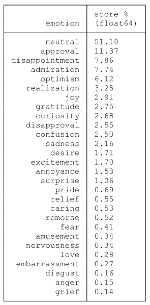



## I paesi “specializzati”
Fra i paesi che prendono parte ai Giochi Olimpici esiste un gruppo che, storicamente, si è specializzato in alcune discipline, ottenendo così la gran parte dei suoi successi all’interno di tale ristretto ambito. Non solo, ma si è potuto osservare che il livello di specializzazione tende a mantenersi nel tempo, gettando la base di ulteriori successi. Come dice il proverbio inglese: “success brings success”.

Al gruppo delle “potenze sportive specializzate” appartiene anche l’Italia. È noto a tutti che la scherma, nelle sue varie branche, è una delle discipline in cui l’Italia eccelle, cosa confermata dai nostri dati. La domanda generale che ci eravamo posti nel progetto l’abbiamo dunque riformulata ad hoc per l’Italia: quali sono le ragioni del successo italiano nella scherma?

## La risposta attraverso la Text Analysis
Per rispondere al quesito, però, questa volta abbiamo adottato un approccio diverso: non ci siamo rivolti ai dati statistici ma ai testi. Abbiamo scaricato e processato circa 400 articoli di giornale, compresi in un intervallo temporale dal 2000 al 2024; l’idea è che all’interno del dibattito pubblico intorno alla scherma si possano trovare sufficienti informazioni per rispondere al quesito. Ciò fatto, si è implementato un semplice sistema RAG (Retrieved Augmented Generation) e la selezione di articoli è stata data un LLM, nella fattispecie Llama, affinché l’intelligenza artificiale trovasse all’interno del corpus le ragioni del successo italiano nella scherma.

La risposta ottenuta, in sintesi, mette in evidenza i seguenti concetti chiave:
- esistenza di una lunga tradizione di schermidori
- supporto da parte di FIS (Federazione Italiana Scherma) e governo nell’implementazione di efficaci politiche sportive, in particolare per quanto riguarda la formazione degli atleti e la qualità dell’allenamento
- presenza di molti atleti di alto livello che hanno creato squadre forti nel temporale
- forte esposizione mediatica della scherma.

Naturalmente, alla risposta data da un LLM, per quanto ottenuta con mezzi allo stato dell’arte, non va dato credito a prescindere, ragion per cui abbiamo provveduto a intervistare un esperto per capire se le conclusioni dell’IA fossero verosimili.

## Sentiment Analysis: la scherma non è un semplice “fatto”
Ma perché limitare l’indagine testuale a un’unica domanda? La potenza degli LLM, infatti, può anche essere usata per addentrarsi nell’ambito della Sentiment Analysis; in particolare, esistono modelli già addestrati per riconoscere il valore “emotivo” di un testo. Un modello come ROBERTA è in grado di riconoscere 26 emozioni e di assegnare al testo, per ognuna di essa, un punteggio fra 0 e 1.

Facendo una media per ogni emozione rilevata dal modello, si può vedere che gli articoli sono “neutrali” al 51%, ma emozioni come “approvazione” (11%), “ammirazione” ecc. ottengono comunque punteggi rilevanti. Questo risultato è tanto più sorprendente se si considera che la funzione primaria degli organi di stampa è quella di informare; in linea teorica, dunque, ci si aspetta che riporti dei fatti in maniera oggettiva. Il fatto che, invece, le vicende della scherma italiana siano emotivamente connotate è assolutamente degno di nota.

La conclusione che si può tirare, compatibile con l’interpretazione data da Llama, è che la scherma italiana, in virtù della sua consolidata tradizione di successi, è più di un semplice sport. La scherma è entrata a far parte dell’identità non solo sportiva dell’Italia, cosa testimoniata anche dall’interesse delle istituzioni pubbliche, ed è caricata di significati e aspettative che vanno al di là della performance sportiva. Ecco che, allora, parlare di scherma non è un semplice “resoconto” ma una narrazione tesa a confermare (o smentire) un pezzo importante dell’identità nazionale.  
